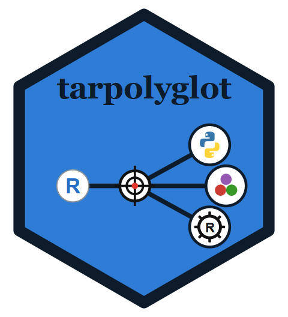

<!-- README.md is generated from README.Rmd. Please edit that file -->

<!-- badges: start -->

[](https://www.repostatus.org/#active) [](https://github.com/Pierre9344/tarpolyglot/actions/workflows/R-CMD-check.yaml) [](https://CRAN.R-project.org/package=tarpolyglot) [](https://cran.r-project.org/web/checks/check_results_tarpolyglot.html) [](https://cran.r-project.org/package=tarpolyglot)
[](https://app.codecov.io/gh/Pierre9344/tarpolyglot)
<!-- badges: end -->

# `{tarpolyglot}` 

`{tarpolyglot}` adds target constructors that run **Python**, **Julia**, **Rust**, and **C++** as first-class steps of a [`{targets}`](https://docs.ropensci.org/targets/) pipeline, via [reticulate](https://rstudio.github.io/reticulate/) (Python), [JuliaCall](https://github.com/JuliaInterop/JuliaCall) (Julia), [rextendr](https://extendr.rs/rextendr/) / [extendr](https://extendr.rs/) (Rust), and [Rcpp](https://cran.r-project.org/web/packages/Rcpp/index.html) (C++). Results come back as converted R objects or as files tracked on disk, and everything a normal `{targets}` step supports works unchanged: dynamic branching, storage formats, resources, cues, `crew` parallelism.

## Installation

You can install `{tarpolyglot}` from CRAN or GitHub for the development version:

``` r
# CRAN
install.package("tarpolyglot")

# GitHub (development version)
# install.packages("remotes")
remotes::install_github("Pierre9344/tarpolyglot@dev", build_vignettes = TRUE, dependencies = TRUE)
```

You also need a working toolchain for whichever language(s) you plan to use: Python, Julia, and/or Rust. Each is independent and only needed if you use the matching constructor (`tar_target_py()`, `tar_target_jl()`, `tar_target_rs()`). See `vignette("get_started")` for the full setup instructions (Python via reticulate/uv, Julia via [juliaup](https://github.com/JuliaLang/juliaup), Rust via [rustup](https://rust-lang.org/tools/install/): use the **GNU** toolchain on Windows so it matches R's ABI). C++ needs no separate toolchain since `Rcpp::sourceCpp()` compiles with R's own compiler, which on Windows means [Rtools](https://cran.r-project.org/bin/windows/Rtools/)).

## The three constructors

- `tar_target_py()` / `tar_target_py_raw()`: Python, via [reticulate](https://rstudio.github.io/reticulate/).
- `tar_target_jl()` / `tar_target_jl_raw()`: Julia, via [JuliaCall](https://github.com/JuliaInterop/JuliaCall).
- `tar_target_rs()` / `tar_target_rs_raw()`: Rust, via [rextendr](https://extendr.rs/rextendr/)/[extendr](https://extendr.rs/).
- `tar_target_cpp()` / `tar_target_cpp_raw()`: C++, via [Rcpp](https://cran.r-project.org/web/packages/Rcpp/index.html).

Each mirrors `targets::tar_target()` / `targets::tar_target_raw()` and forwards every argument (`pattern`, `format`, `deployment`, `resources`, `cue`, ...), so dynamic branching, storage formats, `crew`-based parallelism, and other `{targets}` features all work as usual.

### Example using `tar_target_py`

A minimal pipeline: an R target feeds a Python step, which returns a value that a downstream R target uses.

`scripts/pre.R`:

``` r
to_py <- list(x = x)   # `x` is bound from inputs = c(x = "values")
```

`scripts/mean.py`:

``` python
# `x` is handed over by the pre-script; assign `result` for R to read.
result = {"mean": sum(x) / len(x), "n": len(x)}
```

`_targets.R`:

``` r
library(targets)
library(tarpolyglot)

# Recommended default: run each step in its own worker process so every
# Python/Julia step gets a fresh interpreter. See the "crew" vignette.
tar_option_set(controller = polyglot_controller(workers = 1L))

list(
  tar_target(values, c(2, 4, 6, 8)),

  tar_target_py(
    name = py_mean,
    script = "scripts/mean.py",
    inputs = c(x = "values"),
    pre_script = "scripts/pre.R",
    retrieve = "result"           # returns the Python `result` dict as an R list
  ),

  tar_target(report, sprintf("mean = %.1f over n = %d", py_mean$mean, py_mean$n))
)
```

We can run and inspect it like any `{targets}` pipeline:

``` r
targets::tar_make()
targets::tar_read(py_mean)   # $mean 5  $n 4
targets::tar_read(report)    # "mean = 5.0 over n = 4"
```

Here the `retrieve` argument is used to extract a value from the python environment using `reticulate` type conversion. It is also possible to use a post-python R script to extract one or more values from the python session (e.g. save multiple object as a list, or format the output in R). In the post script, the python session is represented by the `py` object. It is also possible tu use the `py_get()` helper function to extract some variable. Both are created by the steps constructor.

### Inline code with `tar_code()`

The `script`, `pre_script`, and `post_script` arguments do not have to point at a file on disk. Wrap code in `tar_code()` to write it directly in `_targets.R` instead: an R `{ }` block supplies inline R for a `pre_script` or `post_script`, and a character string supplies inline source for the foreign `script` (Python, Julia, or Rust) or for an R pre/post-script. The Python example above can be written entirely inline:

``` r
tar_target_py(
  name = py_mean,
  inputs = c(x = "values"),
  pre_script = tar_code({ to_py <- list(x = x) }),
  script = tar_code("result = {'mean': sum(x) / len(x), 'n': len(x)}"),
  retrieve = "result"
)
```

Multi-line strings work too and are dedented, so you can indent the code to line up with the surrounding `_targets.R` while Python's own block indentation is preserved. Inline code is embedded in the target's command, so `{targets}` hashes it and re-runs the step whenever you edit it (a literal file-path string is untracked unless you wrap it in `tar_target_path()`).

### Julia and Rust similarity and differences

A Julia step is identical apart from the constructor and helper names: use `tar_target_jl()`, a `.jl` script, `to_jl` in the pre-script, and `jl_get()` in a post-script. A Rust step has no pre-script: compile `#[extendr]` functions and call them from the post-script. For Rust in particular, a plain `tar_target()` calling `rextendr::rust_source()` is often enough; `tar_target_rs()` mainly adds toolchain and `crew`-worker build setup plus API symmetry (see `vignette("rust")`).

## Why use `{tarpolyglot}` instead of calling the toolchains directly

- The interpreter or build setup is handled for you: each step binds reticulate, runs `JuliaCall::julia_setup()`, or prepares the extendr build, so you do not repeat that plumbing in every step.
- You move data across the R boundary declaratively: wire upstream targets in with `inputs`, push R objects into the foreign session with `to_py` / `to_jl` in a pre-script, and read results back with `py_get()` / `jl_get()` / `jl_call()` or the `retrieve` / `files` shortcuts.
- Easy selection of environment and language version selection as arguments: choose a Python interpreter or environment (`python`, `env` + `env_manager` for system / virtualenv / venv / uv / poetry / conda, or `python_version`), or a Julia install and project (`julia_version`, `julia_home`, `julia_project`, `julia_packages`). Your selection wins over ambient settings: an explicit environment overrides an inherited `RETICULATE_PYTHON` or `JULIA_PROJECT` (for example one set by RStudio and inherited by `crew` workers).
- Every `{targets}` feature keeps working:
  - the constructors forward the full `targets::tar_target_raw()` argument set (`format`, `deployment`, `resources`, `cue`, `memory`, and so on), so storage formats, cues, and `crew` parallelism behave as usual making `{tarpolyglot}` fully compatible with `{targets}` and `{tarchetypes}`.
  - the constructor `input` argument ensure that `{targets}` detect the dependencies of your polyglot steps.
- Per-step isolation is one line: `polyglot_controller()` (a `crew` controller with `tasks_max = 1`) gives each step a fresh interpreter in its own process. This is the only way around reticulate and JuliaCall binding a single interpreter per session.
- You do not need to adopt a separate build tool like the `{rixpress}` R package does with Nix which is convenient for Windows computer or public computing cluster on which you can't install Nix as a user.

The gains above are largest for **Python and Julia**, where a live interpreter has to be bound and data marshalled across the R boundary on every step. **Rust is different**: `rextendr::rust_source()` compiles your `#[extendr]` functions and hands them back as ordinary R functions, so there is no interpreter to bind and no conversion layer to abstract, and for simple cases a plain `tar_target()` calling `rust_source()` already works. `tar_target_rs()` is still worth using because it puts R, `cargo`, and (on Windows) Rtools on `PATH` and sets `R_HOME` so the build succeeds in a bare or `crew` worker, lets you pick a toolchain per step with `toolchain`, bundles file output, script tracking, and the full `targets::tar_target_raw()` argument set in one call, and keeps the same API as the Python and Julia constructors (see `vignette("rust")`).

## Comparison with other similar tools

### Comparison to `{rixpress}`

I am also aware of `{rixpress}`, which supports reproducible polyglot pipelines using Nix.

I see `{rixpress}` and `{tarpolyglot}` as addressing related needs with different architectures and trade-offs. `{rixpress}` delegates pipeline execution, dependency management, and environment management to Nix, providing strong isolation and reproducibility guarantees.

`{tarpolyglot}` takes a narrower and less prescriptive approach. It remains an extension of `{targets}` and leaves environment management to existing language-specific tools such as virtual environments, Conda, uv, Poetry, Juliaup, Julia projects, and rustup.

The intention is not to reproduce the reproducibility guarantees provided by Nix. Instead, `{tarpolyglot}` is intended for users who want to add multilingual steps incrementally to an existing `{targets}` pipeline, including environments where Nix is unavailable or cannot be installed.

This distinction is relevant for my own work because I use a public computing cluster with restricted user permissions, and the administrators are not currently considering a Nix installation.

### Comparison with T (`tlang`)

I am also aware of [T](https://tstats-project.org/), a domain-specific language for orchestrating polyglot analyses, currently in active development.

T and `{tarpolyglot}` differ more fundamentally than `{rixpress}` and `{tarpolyglot}` do, because T is a language rather than an R package. T owns the orchestration layer itself: pipelines are written in T, which coordinates R, Python, and Julia as computation backends, serialises artifacts across language boundaries automatically, and runs each node in its own sandboxed environment. Its design is strictly functional and immutable, with computation graphs as first-class values.

`{tarpolyglot}` does not own the orchestration layer and does not try to. The pipeline stays an ordinary `{targets}` pipeline written in R, and a multilingual step is one more constructor call in `_targets.R`. Everything a user already knows about `{targets}` (change detection, dynamic branching, storage formats, `crew` parallelism) continues to apply unchanged, and nothing outside the individual step needs to move.

The trade-off is the same shape as with `{rixpress}`, and in the same direction. T offers stronger guarantees: mandatory Nix environments, per-node sandboxing, and automatic cross-language serialisation remove classes of error that `{tarpolyglot}` leaves to the user's own environment management. In exchange, T asks the user to adopt a new language and to have Nix available, whereas `{tarpolyglot}` asks for one function call inside a pipeline they already have.

The two therefore suit different starting points. T is attractive when a polyglot workflow is being designed from scratch and reproducibility guarantees are the priority. `{tarpolyglot}` is aimed at an existing R-centric `{targets}` pipeline that needs one or two steps in another language, and like for `{rixpress}` to the people for which installing Nix is not an option.

## Where to go next

- `vignette("get_started")`: installation and a first pipeline, plus `crew`-based parallelism and per-step isolation (running foreign steps on their own controller while ordinary R targets stay on the main process or a different controller), and the limitations to know before building a large pipeline (one interpreter per session, what can be returned, and more).
- `vignette("python")`: Python steps in depth: the three-script model, object vs file output, dynamic branching, and choosing an environment.
- `vignette("julia")`: the same for Julia (`julia_version`, `julia_project`, `julia_packages`).
- `vignette("rust")`: Rust steps via rextendr/extendr.
- `tar_target_py()`, `tar_target_jl()`, `tar_target_rs()` for their respective documentations.

## AI Disclosure

Claude Code (Anthropic's Claude Opus 4.8, and then Opus 5) was used as an assistant throughout development, with the maintainer reviewing, testing, and directing all changes made by the AI. Concretely, AI assistance was used for:

- **Code reviewing** Revision and improvement of the `tarpolyglot` functions.
- **Documentation.** Drafting and revising the roxygen documentation, including the shared "Script options" / "Script arguments" sections in [`R/shared-params.R`](https://github.com/Pierre9344/tarpolyglot/blob/main/R/shared-params.R), and drafting the vignettes, in particular [`vignettes/scripts.Rmd`](https://github.com/Pierre9344/tarpolyglot/blob/main/vignettes/scripts.Rmd) and `vignettes/cpp.Rmd`.
- **Tests.** Drafting a substantial part of the test suite, including the unit tests for the internal helpers and the end-to-end pipeline tests in [`tests/testthat/test-integration-pipeline.R`](https://github.com/Pierre9344/tarpolyglot/blob/main/tests/testthat/test-integration-pipeline.R). Every assertion was checked against the package's actual behaviour rather than accepted on trust; several drafts were rejected or rewritten because they encoded a platform quirk or tested a mock rather than the package.
- **Continuous integration.** Drafting and debugging the GitHub Actions workflows in [`.github/workflows/`](https://github.com/Pierre9344/tarpolyglot/tree/main/.github/workflows), including the toolchain setup for the integration and coverage jobs.
- **Package logo.** The hex sticker in `man/figures/` (and the derived favicons in `pkgdown/favicon/`) is a SVG generated by Claude Code based on the maintainer prompte. It contains no third-party logo artwork: every element is either an original shape or type set in a font.

## Citation

To cite `{tarpolyglot}`, run `citation("tarpolyglot")` in R, or see the [`CITATION.cff`](CITATION.cff) file (also surfaced by GitHub's "Cite this repository" button).
